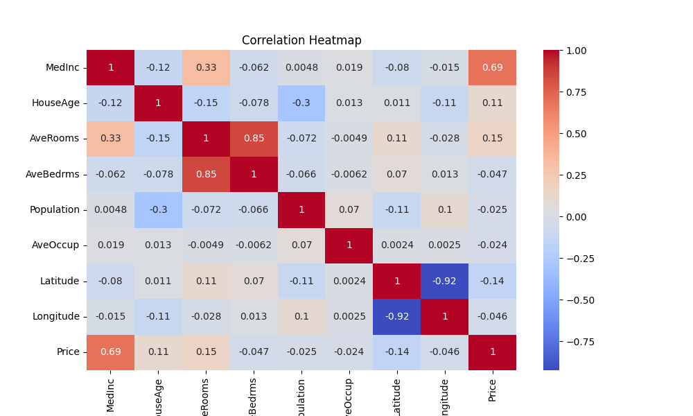
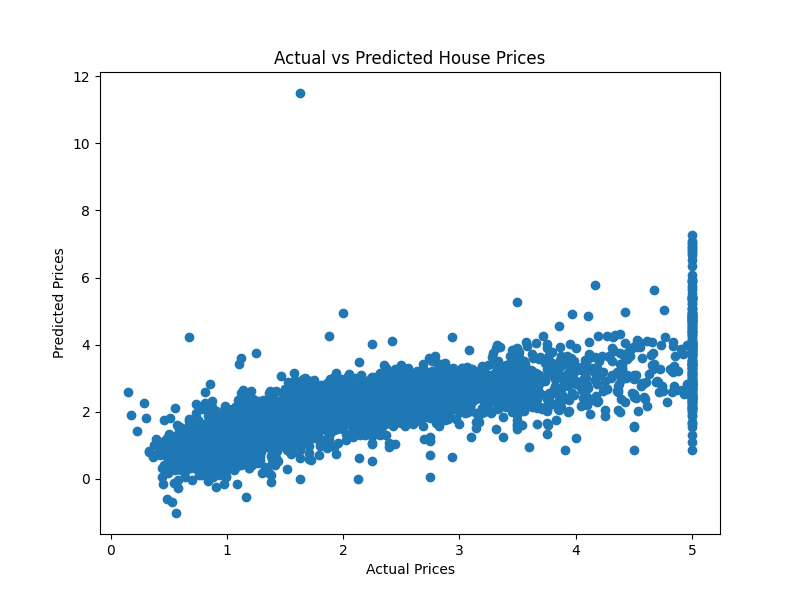

# End-to-End Data Science Project - House Price Prediction

## 📌 Project Description
This is an End-to-End Data Science project that predicts house prices using the **California Housing Dataset**.
The project includes data loading, preprocessing, model training, evaluation, model saving, and deployment using **FastAPI**.

The trained Machine Learning model is deployed as a REST API where users can provide housing input features and receive predicted house price output.

---

## 📊 Output Visualizations

### Correlation Heatmap

### Actual vs Predicted Plot

---

## 🛠 Technologies Used
- Python
- Pandas, NumPy
- Scikit-learn
- Matplotlib, Seaborn
- Joblib
- FastAPI
- Uvicorn

---

---

## 🧪 How to Test Output in Swagger UI

After running the FastAPI server, open this link in browser:

### Steps to Test Prediction:
1. Click **POST /predict**
2. Click **Try it out**
3. Paste the input JSON in the request body
4. Click **Execute**
5. You will get the predicted output in the response section

---
## output

